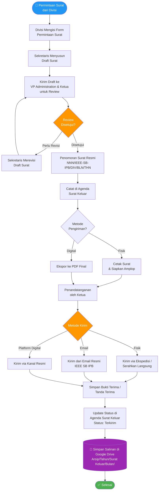

# Diagram Alur — Surat Keluar

## Flowchart Penerbitan Surat Keluar IEEE Student Branch IPB



---

## Format Penomoran Surat Keluar

```
[NomorUrut] / IEEE-SB-IPB / [KodeDivisi] / [BulanRomawi] / [Tahun]

Contoh:
001 / IEEE-SB-IPB / ADM / I / 2026
002 / IEEE-SB-IPB / EXT / III / 2026
```

### Kode Divisi

| Kode | Divisi |
|------|--------|
| `ADM` | Administration |
| `EXT` | External Relations |
| `INT` | Internal Affairs |
| `FIN` | Finance |
| `TEC` | Technical |

---

## Waktu Proses Target

| Tahapan | Target Waktu |
|---------|-------------|
| Penyusunan draft | ≤ 2 hari kerja |
| Proses review & revisi | ≤ 1 hari kerja |
| Penandatanganan | ≤ 1 hari kerja |
| Pengiriman & pengarsipan | ≤ 1 hari kerja |
| **Total** | **≤ 5 hari kerja** |
