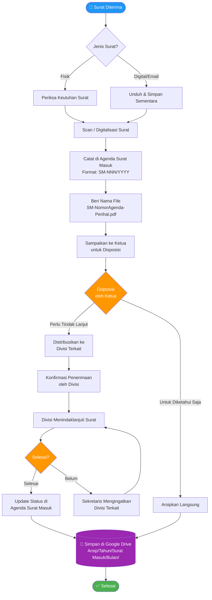

# Diagram Alur — Surat Masuk

## Flowchart Penanganan Surat Masuk IEEE Student Branch IPB

---

## Keterangan Simbol

| Simbol | Keterangan |
|--------|-----------|
| ⬭ (Oval) | Titik awal / akhir proses |
| ▭ (Persegi panjang) | Aktivitas / langkah |
| ◇ (Berlian) | Keputusan / kondisi |
| ⬠ (Silinder) | Penyimpanan data |

---

## Waktu Proses Target

| Tahapan | Target Waktu |
|---------|-------------|
| Pencatatan & digitalisasi | ≤ 1 hari kerja |
| Disposisi oleh Ketua | ≤ 2 hari kerja |
| Distribusi ke divisi | ≤ 1 hari kerja setelah disposisi |
| Pengarsipan final | Segera setelah selesai |
